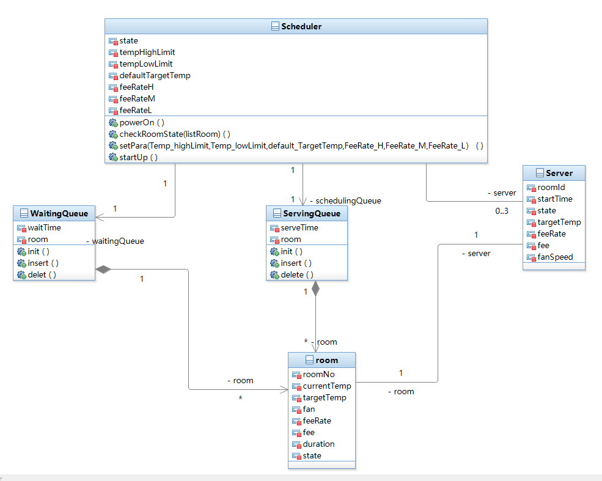

[TOC]

## 静态结构—管理员

### Scheduler

#### 属性

| 属性名            | 说明                              |
| ----------------- | --------------------------------- |
| state             | 中控机状态（set_mode/ready/work） |
| tempHighLimit     | 最高温度限制                      |
| tempLowLimit      | 最低温度限制                      |
| defaultTargetTemp | 默认目标温度                      |
| feeRateH          | 高风速费率                        |
| feeRateM          | 中风速费率                        |
| feeRateL          | 低风速费率                        |

#### 方法

| 方法                                                         | 功能                                             | 形参说明                                                     |
| ------------------------------------------------------------ | ------------------------------------------------ | ------------------------------------------------------------ |
| powerOn()                                                    | 开启空调主机电源，进入设置模式(set_mode)         |                                                              |
| checkRoomState(listRoom)                                     | 监视房间状态                                     | 要监视的房间列表                                             |
| startUp()                                                    | 启动空调服务，系统从设置状态变为工作状态(work)   |                                                              |
| setPara(Temp_highLimit,Temp_lowLimit, default_TargetTemp,FeeRate_H,FeeRate_M,FeeRate_L）() | 设置空调主机工作的参数，然后启动服务进入工作状态 | 最高温，最低温，默认默认目标温度，高风速费率，中风速费率，低风速费率 |

### Server

#### 属性

| 属性名     | 说明                         |
| ---------- | ---------------------------- |
| roomId     | 服务对象所服务的房间号       |
| startTime  | 服务对象开始服务的时间       |
| state      | 服务对象当前状态             |
| targetTemp | 服务对象所服务房间的目标温度 |
| feeRate    | 服务对象所服务房间的费率     |
| fee        | 服务对象所服务房间的费用     |
| fanSpeed   | 服务对象所服务房间的风速     |

### WaitingQueue

#### 属性

| 属性名   | 说明                         |
| -------- | ---------------------------- |
| room     | 在等待队列中的房间对象       |
| waitTime | 等待队列中该房间对象等待时长 |

#### 方法

| 方法     | 功能                     | 形参说明 |
| -------- | ------------------------ | -------- |
| init()   | 初始化等待队列           |          |
| insert() | 向等待队列中插入房间对象 |          |
| delete() | 删除等待队列中的房间对象 |          |

### ServingQueue

#### 属性

| 属性名    | 说明                           |
| --------- | ------------------------------ |
| room      | 在调度队列中的房间对象         |
| serveTime | 服务队列中该房间对象的服务时长 |

#### 方法

| 方法     | 功能                     | 形参说明 |
| -------- | ------------------------ | -------- |
| init()   | 初始化服务队列           |          |
| insert() | 向服务队列中插入房间对象 |          |
| delete() | 删除服务队列中的房间对象 |          |