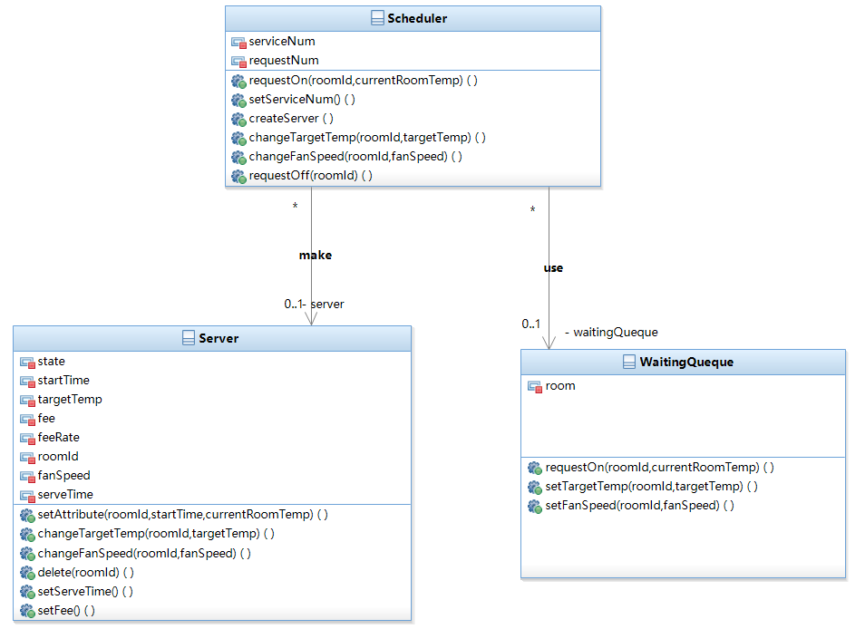
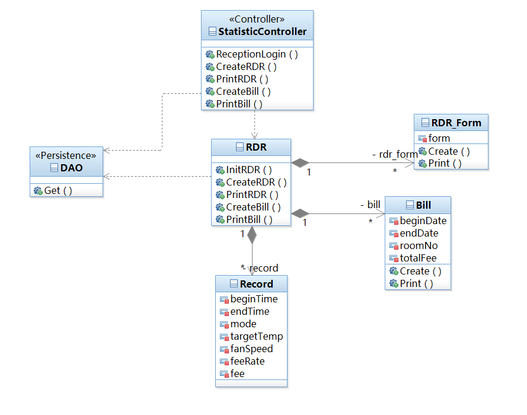

# 静态结构设计

[TOC]

## 用例级类图

### 顾客

### 前台

### 管理员

## 系统级类图

## 基于系统软件类

### Scheduler

- 名称：调度器、调度对象、中控机
- 作用：作为温控系统的中心，为到来的请求分配服务对象，以及提供计费功能

#### 属性

> 注：为体现与代码的一致，这里采用PEP 8的风格命名。可能与上图稍有不同，但仍一一对应

| 属性名              | 功能                           |
| ------------------- | ------------------------------ |
| service_num         | 正在对房间进行服务的服务对象数 |
| request_num         | 发出请求的房间数               |
| state               | 中控机所处的状态               |
| temp_high_limit     | 最高温度限制                   |
| temp_low_limit      | 最低温度限制                   |
| default_target_temp | 默认目标温度                   |
| fee_rate_h          | 高风速时的费率                 |
| fee_rate_l          | 低风速时的费率                 |
| fee_rate_m          | 中风速时的费率                 |

#### 方法

| 方法                                     | 功能                 | 形参说明                                                 |
| ---------------------------------------- | -------------------- | -------------------------------------------------------- |
| request_on(room_id, current_room_temp)   | 处理某房间的开机请求 | room_id为请求的房间号，current_room_temp为房间当前的温度 |
| set_service_num()                        | 更改serviceNum的值   |                                                          |
| create_server()                          | 创建一个服务对象     |                                                          |
| change_target_temp(room_id, target_temp) | 处理某房间的调温请求 |                                                          |
| change_fan_speed(room_id, fan_speed)     | 处理某房间的调风请求 |                                                          |
| request_off(room_id)                     | 处理某房间的关机请求 |                                                          |
| power_on()                               | 打开中控机           |                                                          |
| check_room_state(list_room)              | 查询房间的状态       | 要监视的房间列表                                         |

| set_para(mode, temp_high_limit, temp_low_limit, default_target_temp, fee_rate_h, fee_rate_m,fee_rate_m) |
| ------------------------------------------------------------ |
| 功能：设置中控机相关参数                                     |
|                                                              |

### Server

名称：服务对象

作用：服务对象最多仅存在3个，每个服务对象对应一个房间，供调度算法以及温控使用。

#### 属性

| 属性名      | 说明                         |
| ----------- | ---------------------------- |
| state       | 服务对象的服务状态           |
| start_time  | 服务开始时间                 |
| target_temp | 服务对象所服务房间的目标温度 |
| fee         | 服务对象所服务房间的费用     |
| q           |                              |
| room_id     | 服务对象所服务房间的房间号   |
| fan_speed   | 服务对象所服务房间的风速     |
| serve_time  | 服务对象的服务时长           |

#### 方法

| 方法                                                | 功能                                                         | 形参说明                                                     |
| --------------------------------------------------- | ------------------------------------------------------------ | ------------------------------------------------------------ |
| set_attribute(room_id,start_time,current_room_temp) | 服务对象的服务状态，服务开始时间，目标温度，费率及费用值被赋值； | roomId为请求的房间号，startTime为服务开始时间 ，currentRoomTemp为房间的当前温度 |
| change_target_temp(room_id,target_temp)             | 修改正在服务房间的目标温度                                   | roomId为请求的房间号，targetTemp为房间请求的目标温度         |
| change_fan_speed(room_id,fan_speed)                 | 修改正在服务房间的风速                                       | roomId为请求的房间号，fanSpeed为房间请求的风速               |
| delete(room_id)                                     | 删除服务对象与被服务房间的关联                               | roomId为对应的房间号                                         |
| set_serve_time()                                    | 修改服务时长                                                 |                                                              |
| set_fee()                                           | 修改被服务房间的费用                                         |                                                              |

### WaitingQueue

#### 属性

| 属性名   | 说明                         |
| -------- | ---------------------------- |
| room     | 在等待队列中的房间对象       |
| waitTime | 等待队列中该房间对象等待时长 |

#### 方法

| 方法                                  | 功能                                     | 形参说明                                                 |
| ------------------------------------- | ---------------------------------------- | -------------------------------------------------------- |
| request_on(room_id,current_room_temp) | 在等待队列中加入状态为关机的房间对象     | room_id为对应的房间号，current_room_temp为房间的当前温度 |
| set_target_temp(room_id,target_temp)  | 更改在等待队列中的对应房间的目标温度属性 | room_id为请求的房间号，target_temp为房间请求的目标温度   |
| set_fan_speed(room_id,fan_speed)      | 更改在等待队列中的对应房间的风速属性     | room_id为请求的房间号，fan_speed为房间请求的风速         |
| init()                                | 初始化等待队列                           |                                                          |
| insert()                              | 向等待队列中插入房间对象                 |                                                          |
| delete()                              | 删除等待队列中的房间对象                 |                                                          |

### ServingQueue

#### 属性

| 属性名     | 说明                           |
| ---------- | ------------------------------ |
| room_list  | 在调度队列中的房间对象         |
| serve_time | 服务队列中该房间对象的服务时长 |

#### 方法

| 方法     | 功能                     | 形参说明 |
| -------- | ------------------------ | -------- |
| init()   | 初始化服务队列           |          |
| insert() | 向服务队列中插入房间对象 |          |
| delete() | 删除服务队列中的房间对象 |          |

### Room

#### 属性

| 属性名       | 功能     |
| ------------ | -------- |
| room_no      | 房间号   |
| current_temp | 当前温度 |
| target_temp  | 目标温度 |
| fan_speed    | 风速     |
| duration     | 服务时长 |
| state        | 服务状态 |

### StatisticController

- 名称：统计控制器
- 作用：负责读数据库的控制器，为前台生成详单、账单

#### 属性

​	无

#### 方法

| 方法                                       | 功能         | 形参说明           |
| ------------------------------------------ | ------------ | ------------------ |
| reception_login(id, password)              | 前台人员登录 | id, password：密码 |
| create_rdr(room_no, begin_date, end_date)  | 创建详单     | 房间号、起/止日期  |
| print_rdr()                                | 打印详单     |                    |
| create_bill(room_no, begin_date, end_date) | 创建账单     | 房间号、起/止日期  |
| print_bill()                               | 打印账单     |                    |

### RDR

- 名称：请求详单类
- 作用：处理详单、账单请求，读取并创建相关记录、详单和账单

#### 属性

| 属性名      | 功能     |
| ----------- | -------- |
| record_list | 记录列表 |
| rdr_form    | 详单     |
| bill        | 账单     |

#### 方法

| 方法                                       | 功能                 | 形参说明          |
| ------------------------------------------ | -------------------- | ----------------- |
| init_rdr()                                 | 初始化对象           |                   |
| create_rdr(room_no, begin_date, end_date)  | 创建详单             | 房间号、起/止日期 |
| print_rdr()                                | 打印详单             |                   |
| create_bill(room_no, begin_date, end_date) | 计算总费用，创建账单 | 房间号、起/止日期 |
| print_bill()                               | 打印账单             |                   |

### Record

- 名称：详单记录
- 作用：每个对象记录了一条详单记录

#### 属性

| 属性名      | 功能     |
| ----------- | -------- |
| begin_time  | 开始时间 |
| end_time    | 结束时间 |
| target_temp | 目标温度 |
| mode        | 模式     |
| fan_speed   | 风速     |
| fee_rate    | 费率     |
| fee         | 费用     |

#### 方法

​	无

### RDR_Form

- 名称：详单
- 作用：创建、打印详单

#### 属性

| 属性名 | 功能         |
| ------ | ------------ |
| form   | 储存详单内容 |

#### 方法

| 方法         | 功能     | 形参说明                  |
| ------------ | -------- | ------------------------- |
| create(form) | 创建详单 | form:字符串，记录详单内容 |
| print()      | 打印详单 |                           |

### Bill

- 名称：账单
- 作用：创建、打印账单

#### 属性

| 属性名     | 功能     |
| ---------- | -------- |
| begin_date | 开始日期 |
| end_date   | 截止日期 |
| room_no    | 房间号   |
| total_fee  | 总费用   |

#### 方法

| 方法                                             | 功能     | 形参说明 |
| ------------------------------------------------ | -------- | -------- |
| create(begin_date, end_date, room_no, total_fee) | 创建账单 | 见属性名 |
| print()                                          | 打印账单 |          |

### Report

- 名称：报告
- 作用：创建、打印报告

#### 属性

无

#### 方法

| 方法                                           | 功能         | 形参说明 |
| ---------------------------------------------- | ------------ | -------- |
| query_report(list_room_id, type_report, date)  | 查询报告     | 见属性名 |
| print_report(report_id)                        | 打印报告     |          |
| create_report(list_room_id, type_report, date) | 创建报告实体 | Report   |

### ReportFile

- 名称：报告实体
- 作用：创建报告

#### 属性

无

#### 方法

| 方法           | 功能         | 形参说明       |
| -------------- | ------------ | -------------- |
| create(report) | 创建报表文件 | 查询出来的报告 |

### DAO

> 注：对于我们所使用的模型而言，Django已经提供了一套较为完善的数据库接口，也就是对应的DAO层，因此，我们不再进行详细设计，只调用其接口。

#### 方法

| 方法  | 功能 | 形参说明 |
| ----- | ---- | -------- |
| get() | 查询 |          |